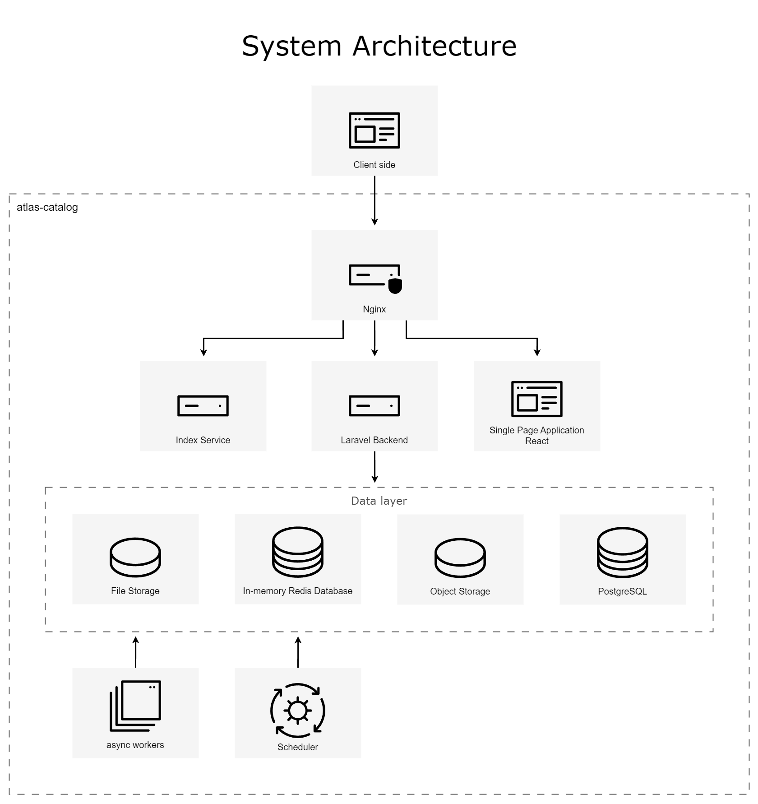

<p align="center"></p>

[](https://sonarcloud.io/summary/new_code?id=angelcamposm_atlas-catalog)
[](https://sonarcloud.io/summary/new_code?id=angelcamposm_atlas-catalog)
[](https://sonarcloud.io/summary/new_code?id=angelcamposm_atlas-catalog)
[](https://sonarcloud.io/summary/new_code?id=angelcamposm_atlas-catalog)
[](https://sonarcloud.io/summary/new_code?id=angelcamposm_atlas-catalog)


## About Atlas Catalog

Atlas Catalog is a modern, RESTful API designed to serve as a centralized and comprehensive inventory for all microservices, APIs, and digital assets within an organization. Built on Laravel, it provides a robust and scalable solution for discovering, managing, and understanding the complex landscape of a distributed architecture.

Key features include:
- **Centralized Service Discovery**: A single source of truth for all your APIs and services.
- **Rich Metadata Management**: Track essential information such as endpoints, versions, ownership, access policies, and documentation.
- **Business Domain Organization**: Group services by business domains to provide clear context and ownership.
- **Standardized & RESTful**: A clean, predictable API that follows modern best practices for easy integration.
- **Extensible by Design**: Easily add new metadata or integrate with other developer tools.

Whether you are a developer looking for service documentation, a platform engineer managing the ecosystem, or an architect designing new systems, Atlas Catalog provides the visibility and control needed to navigate your microservices landscape with confidence.

## � Quick Start with Docker

The easiest way to run the complete project (Backend + Frontend) is using Docker Compose.

### Prerequisites

- [Docker](https://docs.docker.com/get-docker/) (v20.10+)
- [Docker Compose](https://docs.docker.com/compose/install/) (v2.0+)

### Run the Full Stack

```bash
# Clone the repository
git clone https://github.com/angelcamposm/atlas-catalog.git
cd atlas-catalog

# Start all services (first run will build images)
docker compose -f docker-compose.full.yml up --build

# Or run in detached mode (background)
docker compose -f docker-compose.full.yml up -d --build
```

### Access the Application

Once the containers are running:

| Service | URL | Description |
|---------|-----|-------------|
| **Frontend** | http://localhost:3001 | Next.js Web Application |
| **Backend API** | http://localhost:8080/api/v1 | Laravel REST API |
| **API Health** | http://localhost:8080/api/v1/catalog/apis | Sample endpoint |

### Services Architecture

The full stack includes:

| Container | Service | Port |
|-----------|---------|------|
| `atlas-frontend` | Next.js 15 Frontend | 3001 |
| `atlas-nginx` | Nginx (API Gateway) | 8080 |
| `atlas-app` | PHP-FPM (Laravel) | 9000 |
| `atlas-postgres` | PostgreSQL 17 | 5432 |
| `atlas-redis` | Redis 8 | 6379 |

### Common Docker Commands

```bash
# View logs
docker compose -f docker-compose.full.yml logs -f

# View logs for a specific service
docker compose -f docker-compose.full.yml logs -f frontend
docker compose -f docker-compose.full.yml logs -f app

# Stop all services
docker compose -f docker-compose.full.yml down

# Stop and remove volumes (clean reset)
docker compose -f docker-compose.full.yml down -v

# Rebuild a specific service
docker compose -f docker-compose.full.yml build frontend
docker compose -f docker-compose.full.yml up -d frontend

# Check service status
docker compose -f docker-compose.full.yml ps

# Execute commands in containers
docker compose -f docker-compose.full.yml exec app php artisan migrate
docker compose -f docker-compose.full.yml exec app php artisan tinker
```

### Environment Configuration

The Docker setup uses sensible defaults. For production deployments or custom configurations, you can override environment variables:

```bash
# Backend API URL for frontend (default: http://localhost:8080/api)
NEXT_PUBLIC_API_URL=http://your-api-host:8080/api

# Database credentials (defaults in docker-compose.full.yml)
DB_HOST=postgres
DB_DATABASE=atlas-catalog
DB_USERNAME=laravel
DB_PASSWORD=secret
```

### Development Mode

For development with hot-reloading:

```bash
# Use the development compose file (if available)
docker compose -f docker-compose.full-dev.yml up --build
```

## 🛠️ Tech Stack

**Backend**:
- Laravel 12.x
- PHP 8.4+
- PostgreSQL 17
- Redis 8
- RESTful API

**Frontend**:
- Next.js 15
- React 19
- TypeScript
- Tailwind CSS
- next-intl (i18n)

**Infrastructure**:
- Docker & Docker Compose
- Nginx (reverse proxy)
- PHP-FPM

## System Architecture



## 📚 Additional Documentation

- [Backend API Reference](docs/BACKEND_API_REFERENCE.md)
- [Frontend Implementation Plan](docs/FRONTEND_IMPLEMENTATION_PLAN.md)
- [Docker Configuration](DOCKER.md)
- [Full Stack Setup Guide](FULL_STACK_SETUP.md)

## License

The Atlas Catalog is open-sourced software licensed under the [MIT license](https://opensource.org/licenses/MIT).

## Support Us

Like this project! Star it on GitHub ⭐. Your support means a lot to us.
