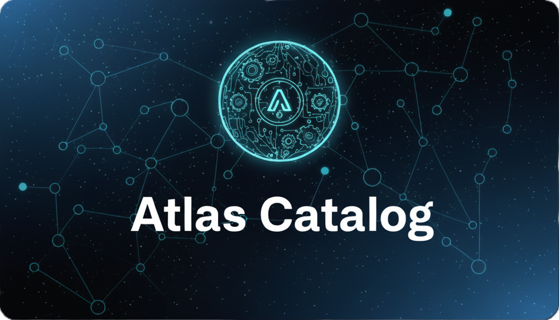

<p align="center"></p>

## About Atlas Catalog

Atlas Catalog is a modern full-stack application designed to serve as a centralized and comprehensive inventory for all microservices, APIs, and digital assets within an organization. It consists of:

-   **Backend**: Laravel 11-based RESTful API for managing APIs, lifecycles, types, and metadata
-   **Frontend**: Next.js 15 application with TypeScript for consuming and visualizing the API catalog

Key features include:

-   **Centralized Service Discovery**: A single source of truth for all your APIs and services.
-   **Rich Metadata Management**: Track essential information such as endpoints, versions, ownership, access policies, and documentation.
-   **Business Domain Organization**: Group services by business domains to provide clear context and ownership.
-   **Modern Web Interface**: Intuitive Next.js frontend with TypeScript and Tailwind CSS.
-   **Standardized & RESTful**: A clean, predictable API that follows modern best practices for easy integration.
-   **Extensible by Design**: Easily add new metadata or integrate with other developer tools.

Whether you are a developer looking for service documentation, a platform engineer managing the ecosystem, or an architect designing new systems, Atlas Catalog provides the visibility and control needed to navigate your microservices landscape with confidence.

## Project Structure

```
atlas-catalog/
├── src/                    # Laravel Backend (API)
│   ├── app/               # Application code (Models, Controllers, etc.)
│   ├── database/          # Migrations, seeders, and factories
│   ├── routes/            # API routes
│   └── tests/             # PHPUnit tests
├── frontend/              # Next.js Frontend
│   ├── app/              # Next.js pages (App Router)
│   ├── components/       # React components
│   ├── lib/              # API client and utilities
│   └── types/            # TypeScript definitions
├── .github/              # CI/CD and instructions
└── docker-compose.yml    # Docker orchestration
```

## Getting Started

### 🚀 Quick Start (Recomendado)

#### Método 1: Script Automatizado

```bash
# Ejecutar script de setup
./setup.sh
```

El script automáticamente:

-   ✅ Verifica prerrequisitos (Docker, Docker Compose)
-   ✅ Copia archivos de entorno (.env)
-   ✅ Inicia servicios Docker
-   ✅ Ejecuta migraciones y seeders
-   ✅ Muestra URLs de servicios

#### Método 2: Usando Makefile

```bash
# Setup inicial
make setup

# Iniciar desarrollo
make dev-d

# Ejecutar migraciones
make fresh

# Ver todos los comandos disponibles
make help
```

### 🏥 Health Check

Verificar el estado de todos los servicios:

```bash
# Ejecutar script de health check
./health-check.sh

# O manualmente
curl http://localhost:8080/api/health
```

### 📚 Documentación Detallada

-   [QUICK_START.md](QUICK_START.md) - Guía de inicio rápido
-   [FULL_STACK_SETUP.md](FULL_STACK_SETUP.md) - Setup completo sin Docker
-   [DOCKER.md](DOCKER.md) - Documentación Docker detallada

### Backend (Laravel API)

1. Navigate to the `src` directory:

```bash
cd src
```

2. Install PHP dependencies:

```bash
composer install
```

3. Configure environment:

```bash
cp .env.example .env
php artisan key:generate
```

4. Run migrations and seeders:

```bash
php artisan migrate --seed
```

5. Start the development server:

```bash
php artisan serve
```

The API will be available at `http://localhost:8000`

### Frontend (Next.js)

1. Navigate to the `frontend` directory:

```bash
cd frontend
```

2. Install Node dependencies:

```bash
npm install
```

3. Configure environment:

```bash
cp .env.local.example .env.local
```

4. Start the development server:

```bash
npm run dev
```

The frontend will be available at `http://localhost:3000`

### 🐳 Docker Deployment

El proyecto incluye dos configuraciones de Docker Compose:

-   **`docker-compose.yml`**: Entorno de producción optimizado
-   **`docker-compose.dev.yml`**: Entorno de desarrollo con hot-reload

### Quick Start con Makefile

El proyecto incluye un Makefile con comandos útiles. Ver todos los comandos disponibles:

```bash
make help
```

#### Desarrollo (Recomendado)

```bash
# Setup inicial (copiar archivos .env)
make setup

# Iniciar entorno de desarrollo
make dev-d

# Ver logs
make logs

# Ejecutar migraciones y seeders
make fresh

# Detener
make down
```

#### Comandos Útiles

```bash
# Ver estado de contenedores
make ps

# Ver logs de un servicio específico
make logs-backend
make logs-frontend

# Acceder a shells
make shell-backend
make shell-frontend

# Base de datos
make migrate          # Ejecutar migraciones
make seed            # Ejecutar seeders
make fresh           # Recrear DB con seeders

# Testing
make test            # Ejecutar tests
make lint-backend    # Verificar código

# Información del proyecto
make info
```

### Deployment Manual

#### Desarrollo

```bash
# 1. Copiar archivos de entorno
cp .env.example .env
cp src/.env.example src/.env
cp frontend/.env.local.example frontend/.env.local

# 2. Iniciar servicios
docker-compose -f docker-compose.dev.yml up --build -d

# 3. Ejecutar migraciones
docker exec -it atlas-backend-dev php artisan migrate:fresh --seed
```

#### Producción

```bash
# 1. Configurar variables de entorno
cp .env.example .env
# Editar .env con valores de producción

# 2. Iniciar servicios
docker-compose up --build -d

# 3. Ejecutar migraciones
docker exec -it atlas-backend php artisan migrate --force
```

### Servicios Disponibles

| Servicio       | URL                       | Descripción        |
| -------------- | ------------------------- | ------------------ |
| Frontend       | http://localhost:3000     | Aplicación Next.js |
| Backend API    | http://localhost:8080/api | API REST Laravel   |
| Redis Insights | http://localhost:5540     | GUI para Redis     |
| PostgreSQL     | localhost:5432            | Base de datos      |
| Redis          | localhost:6379            | Cache              |

### Comandos Docker Compose

```bash
# Ver logs
docker-compose -f docker-compose.dev.yml logs -f

# Parar servicios
docker-compose -f docker-compose.dev.yml down

# Recrear servicios
docker-compose -f docker-compose.dev.yml up --build --force-recreate

# Limpiar volúmenes
docker-compose -f docker-compose.dev.yml down -v
```

## Documentation

-   **Backend API**: See `src/README.md` for Laravel backend documentation
-   **Frontend**: See `frontend/README.md` for Next.js frontend documentation
-   **API Endpoints**: Check `src/routes/api.php` for available endpoints

## Tech Stack

### Backend

-   Laravel 11.x
-   PHP 8.2+
-   SQLite/MySQL/PostgreSQL
-   RESTful API

### Frontend

-   Next.js 15 (App Router)
-   TypeScript (strict mode)
-   React 18
-   Tailwind CSS
-   Custom API client

## License

The Atlas Catalog is open-sourced software licensed under the [MIT license](https://opensource.org/licenses/MIT).
