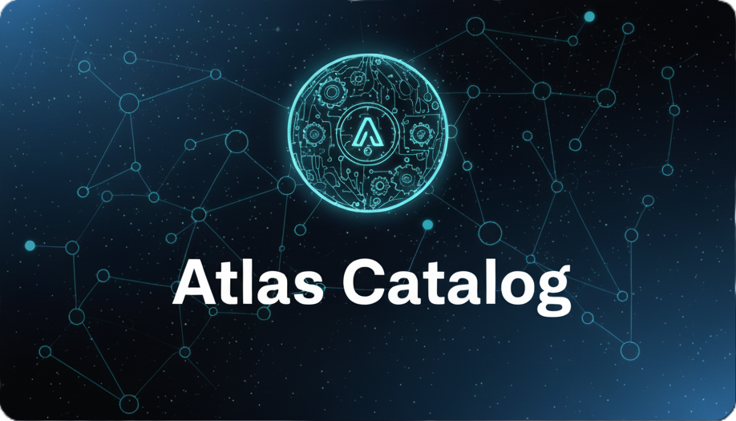
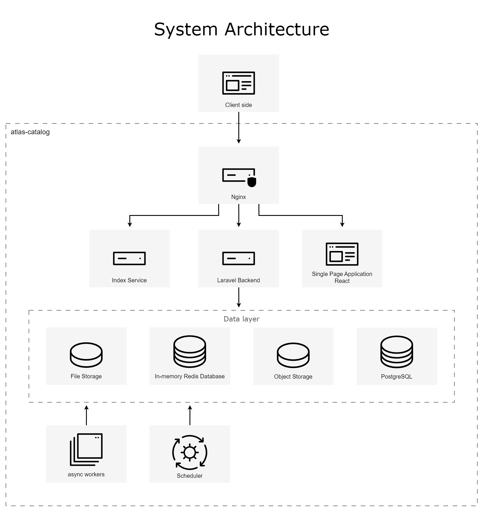

<p align="center"></p>

[](https://sonarcloud.io/summary/new_code?id=angelcamposm_atlas-catalog)
[](https://sonarcloud.io/summary/new_code?id=angelcamposm_atlas-catalog)
[](https://sonarcloud.io/summary/new_code?id=angelcamposm_atlas-catalog)
[](https://sonarcloud.io/summary/new_code?id=angelcamposm_atlas-catalog)
[](https://sonarcloud.io/summary/new_code?id=angelcamposm_atlas-catalog)

## About Atlas Catalog

Atlas Catalog is a modern, RESTful API designed to serve as a centralized and comprehensive inventory for all microservices, APIs, and digital assets within an organization. Built on Laravel, it provides a robust and scalable solution for discovering, managing, and understanding the complex landscape of a distributed architecture.

Key features include:

- **Centralized Service Discovery**: A single source of truth for all your APIs and services.
- **Rich Metadata Management**: Track essential information such as endpoints, versions, ownership, access policies, and documentation.
- **Business Domain Organization**: Group services by business domains to provide clear context and ownership.
- **Standardized & RESTful**: A clean, predictable API that follows modern best practices for easy integration.
- **Extensible by Design**: Easily add new metadata or integrate with other developer tools.

Whether you are a developer looking for service documentation, a platform engineer managing the ecosystem, or an architect designing new systems, Atlas Catalog provides the visibility and control needed to navigate your microservices landscape with confidence.

## 🚀 Quick Start (recomendado)

La forma más rápida y fiable de tener **todo el stack funcionando** (PostgreSQL + Redis + Laravel API + Frontend Next.js + migraciones + seeders) es con Docker Compose. Pensado para que alguien que llegue por primera vez pueda **probar el proyecto en menos de 5 minutos** sin instalar PHP, Node ni nada local.

### Prerrequisitos

- [Docker](https://docs.docker.com/get-docker/) v20.10+
- [Docker Compose](https://docs.docker.com/compose/install/) v2.0+ (incluido en Docker Desktop)
- ~4 GB de RAM libre
- Puertos libres: `3001`, `5432`, `6379`, `8080`, `9000`

> No necesitas instalar PHP, Composer, Node ni pnpm para este flujo. Todo se ejecuta dentro de contenedores.

### 1. Clonar el repositorio

```bash
git clone https://github.com/angelcamposm/atlas-catalog.git
cd atlas-catalog
```

### 2. Arrancar el stack completo

```bash
# Primer arranque (construye imágenes, aplica migraciones y seeders automáticamente)
docker compose -f docker-compose.full.yml up --build

# O en background
docker compose -f docker-compose.full.yml up -d --build
```

El primer arranque puede tardar varios minutos porque construye las imágenes del backend y del frontend. Los siguientes arranques son casi inmediatos.

> El servicio `init-db` se encarga de aplicar `php artisan migrate --force` y `db:seed --force` automáticamente antes de levantar la API. **No tienes que ejecutar migraciones a mano.**

### 3. Acceder a la aplicación

Cuando los contenedores estén `healthy`:

| Servicio               | URL                                       | Descripción                          |
| ---------------------- | ----------------------------------------- | ------------------------------------ |
| **Frontend**           | http://localhost:3001                     | Aplicación Next.js                   |
| **Backend API**        | http://localhost:8080/api/v1              | API REST de Laravel                  |
| **API Docs (OpenAPI)** | http://localhost:8080/docs/api            | Documentación interactiva (Scramble) |
| **Endpoint de prueba** | http://localhost:8080/api/v1/catalog/apis | Devuelve la lista de APIs sembradas  |

### 4. Verificar que todo funciona

```bash
# Estado de los contenedores
docker compose -f docker-compose.full.yml ps

# Probar el backend desde la terminal
curl http://localhost:8080/api/v1/catalog/apis

# Probar el frontend
open http://localhost:3001        # macOS
xdg-open http://localhost:3001    # Linux
```

Si el frontend carga datos sin errores de conexión, **el stack está funcionando correctamente**.

### 5. Parar el stack

```bash
# Parar manteniendo datos de la base de datos
docker compose -f docker-compose.full.yml down

# Parar y borrar volúmenes (reset completo de la DB)
docker compose -f docker-compose.full.yml down -v
```

### Servicios incluidos en el stack

| Contenedor       | Servicio              | Puerto host |
| ---------------- | --------------------- | ----------- |
| `atlas-frontend` | Next.js 16 Frontend   | 3001        |
| `atlas-nginx`    | Nginx (API Gateway)   | 8080        |
| `atlas-app`      | PHP-FPM (Laravel 12)  | 9000        |
| `atlas-postgres` | PostgreSQL 17         | 5432        |
| `atlas-redis`    | Redis 8               | 6379        |
| `atlas-init-db`  | Migraciones + seeders | (one-shot)  |

Servicios opcionales (perfil `monitoring`):

```bash
docker compose -f docker-compose.full.yml --profile monitoring up -d
```

| Contenedor             | Servicio     | Puerto host |
| ---------------------- | ------------ | ----------- |
| `atlas-redis-insights` | RedisInsight | 5540        |
| `atlas-grafana`        | Grafana      | 3000        |

### API Documentation

La API está documentada con **[Scramble](https://scramble.dedoc.co/)** (OpenAPI auto-generado a partir del código). Disponible en:

- `http://localhost:8080/docs/api` — UI interactiva con "Try it"

No hay specs YAML que mantener a mano: la documentación se regenera con cada cambio en los controladores.

### Comandos Docker útiles

```bash
# Logs en tiempo real (todos los servicios)
docker compose -f docker-compose.full.yml logs -f

# Logs de un servicio concreto
docker compose -f docker-compose.full.yml logs -f frontend
docker compose -f docker-compose.full.yml logs -f app
docker compose -f docker-compose.full.yml logs -f init-db

# Reconstruir un servicio (tras cambios en su Dockerfile)
docker compose -f docker-compose.full.yml build frontend
docker compose -f docker-compose.full.yml up -d frontend

# Ejecutar artisan dentro del contenedor backend
docker compose -f docker-compose.full.yml exec app php artisan migrate:status
docker compose -f docker-compose.full.yml exec app php artisan tinker
docker compose -f docker-compose.full.yml exec app php artisan route:list

# Resetear la base de datos (borra datos, recrea esquema y reseed)
docker compose -f docker-compose.full.yml exec app php artisan migrate:fresh --seed
```

### Troubleshooting

| Síntoma                                        | Solución                                                                                  |
| ---------------------------------------------- | ----------------------------------------------------------------------------------------- |
| Puerto 8080/3001/5432 ya en uso                | Para el servicio que lo ocupa o cambia el mapeo en `docker-compose.full.yml`              |
| El frontend muestra "Failed to fetch"          | Verifica `curl http://localhost:8080/api/v1/catalog/apis`. Si falla, revisa logs de `app` |
| `init-db` falla con "duplicate key"            | Es normal en re-arranques: los seeders no son idempotentes y el contenedor sigue          |
| La DB queda corrupta o quieres empezar de cero | `docker compose -f docker-compose.full.yml down -v` y vuelve a arrancar                   |
| Cambios en código backend no se reflejan       | El stack `full` corre en modo producción. Usa el modo desarrollo (ver abajo)              |

### Modo desarrollo (con hot-reload)

Si vas a tocar código y quieres que los cambios se reflejen en caliente:

```bash
docker compose -f docker-compose.full-dev.yml up --build
```

Alternativamente, el `Makefile` ofrece atajos:

```bash
make dev          # Levantar entorno dev en foreground
make dev-d        # Levantar entorno dev en background
make logs         # Ver logs
make migrate      # Ejecutar migraciones
make fresh        # Reset DB + seed
make down         # Parar contenedores
make help         # Ver todos los comandos disponibles
```

### Configuración de variables de entorno

El `docker-compose.full.yml` usa valores por defecto sensatos. Para personalizarlos crea un `.env` en la raíz (basado en `.env.example`):

```bash
cp .env.example .env
```

Variables relevantes:

```env
# Backend
DB_DATABASE=atlas-catalog
DB_USERNAME=laravel
DB_PASSWORD=secret

# Frontend → Backend
NEXT_PUBLIC_API_URL=http://localhost:8080/api
```

---

## 🧑‍💻 Desarrollo local sin Docker (avanzado)

Si prefieres ejecutar el backend con `php artisan serve` y el frontend con `pnpm dev`:

### Backend (Laravel)

```bash
cd src
cp .env.example .env
composer install
php artisan key:generate
php artisan migrate --seed
php artisan serve              # http://localhost:8000
```

Necesitas: PHP 8.4+, Composer 2+, PostgreSQL 17 y Redis 8 corriendo localmente.

### Frontend (Next.js)

```bash
cd frontend
cp .env.local.example .env.local
# Edita .env.local y apunta NEXT_PUBLIC_API_URL al backend (p.ej. http://localhost:8000/api)
pnpm install
pnpm dev                       # http://localhost:3001
```

Necesitas: Node.js 20+ y pnpm 10+.

Ver el [README del frontend](frontend/README.md) para más detalles.

## 🛠️ Tech Stack

**Backend**

- Laravel 12.x · PHP 8.4+
- PostgreSQL 17 · Redis 8
- API REST documentada con Scramble (OpenAPI)

**Frontend**

- Next.js 16 · React 19 · TypeScript (strict)
- Tailwind CSS v4 · shadcn/ui
- next-intl (i18n: en, es)

**Infraestructura**

- Docker & Docker Compose
- Nginx (reverse proxy / API gateway)
- PHP-FPM

## System Architecture



## 🧪 Tests

El proyecto tiene tres suites de tests independientes. Esta tabla resume **qué necesitas tener corriendo** para cada una:

| Suite                           | Tooling               | ¿Necesita backend levantado? | ¿Necesita frontend levantado?   | ¿Necesita Docker? |
| ------------------------------- | --------------------- | ---------------------------- | ------------------------------- | ----------------- |
| Backend (Unit + Feature + Arch) | PHPUnit               | No (usa SQLite en memoria)   | No                              | No                |
| Frontend unit / integration     | Jest + Testing Lib    | No (mock de `fetch`)         | No                              | No                |
| Frontend E2E                    | Playwright (Chromium) | **Sí** (la API real)         | Sí (Playwright lo arranca solo) | Recomendado       |

### Backend — PHPUnit

```bash
cd src
composer install                                # sólo la primera vez
php -d memory_limit=1024M ./vendor/bin/phpunit  # todos los tests
php -d memory_limit=1024M ./vendor/bin/phpunit --testsuite=Unit
php -d memory_limit=1024M ./vendor/bin/phpunit --testsuite=Feature
php -d memory_limit=1024M ./vendor/bin/phpunit --testsuite=Architecture
```

> ℹ️ La suite usa SQLite en memoria (`DB_CONNECTION=sqlite`, `DB_DATABASE=:memory:` en `phpunit.xml`), por lo que **no necesitas Postgres ni el stack Docker** para correr los tests. Sí necesita PHP 8.4+ y las dependencias instaladas con `composer install`.
>
> El flag `-d memory_limit=1024M` es necesario porque la suite completa supera el límite por defecto de 128 MB.

Desde el contenedor Docker (sin instalar PHP local):

```bash
docker compose -f docker-compose.full.yml exec app php artisan test
# o equivalente:
docker compose -f docker-compose.full.yml exec app php -d memory_limit=1024M ./vendor/bin/phpunit
```

**Cobertura** (requiere Xdebug o PCOV instalado en PHP):

```bash
cd src
XDEBUG_MODE=coverage php -d memory_limit=2048M ./vendor/bin/phpunit
# Reportes generados en src/coverage/
#   - HTML:    src/coverage/html/index.html
#   - Clover:  src/coverage/clover.xml
#   - Texto:   src/coverage/coverage.txt
```

### Frontend — Jest (unit / integration)

Tests aislados que mockean el cliente HTTP. **No requieren backend ni servidor Next.js**.

```bash
cd frontend
pnpm install                          # sólo la primera vez
pnpm test                             # ejecutar todos los tests
pnpm test:watch                       # modo watch
pnpm test -- path/del/test            # un test concreto
pnpm test -- --coverage               # con cobertura (reporte en frontend/coverage/)
```

### Frontend — Playwright (E2E)

Tests end-to-end contra la app real en un navegador. **Sí necesitan el backend en `http://localhost:8080`**.

```bash
# 1) Levanta el backend (sin frontend, lo arranca Playwright)
docker compose -f docker-compose.full.yml up -d postgres redis init-db app nginx

# 2) Instala los navegadores de Playwright (sólo la primera vez)
cd frontend
pnpm exec playwright install --with-deps chromium

# 3) Ejecuta los tests
pnpm test:e2e                # headless
pnpm test:e2e:ui             # UI mode (interactivo)
pnpm test:e2e:headed         # con navegador visible
pnpm test:e2e:debug          # debug paso a paso
pnpm test:e2e:report         # ver el último reporte HTML
```

Variables útiles:

```bash
E2E_BASE_URL=http://localhost:3001 pnpm test:e2e   # apuntar a otra URL del frontend
```

### Cobertura actual

Snapshot a fecha de la última ejecución local:

| Suite                     | Resultado                                                     | Cobertura (Lines / Statements / Branches / Functions)              |
| ------------------------- | ------------------------------------------------------------- | ------------------------------------------------------------------ |
| Backend (PHPUnit)         | 1.598 tests · 4.203 aserciones · 21 fallos en arquitectura ⚠️ | Requiere Xdebug/PCOV para reportar — disponible en `src/coverage/` |
| Frontend (Jest)           | 94 suites · 1.402 tests · ✅ todos pasan                      | **76,4% / 73,7% / 72,8% / 68,4%**                                  |
| Frontend (Playwright E2E) | 48 specs                                                      | n/a (E2E)                                                          |

> Los 21 fallos del backend están concentrados en la suite `Architecture` (reglas de tipos estrictos en seeders). No bloquean la funcionalidad. Si tu cambio toca esa zona, ejecuta `--testsuite=Architecture` para validarlo.

## 📚 Additional Documentation

- [Backend API Reference](docs/BACKEND_API_REFERENCE.md)
- [Frontend Implementation Plan](docs/FRONTEND_IMPLEMENTATION_PLAN.md)
- [Docker Configuration](DOCKER.md)
- [Full Stack Setup Guide](FULL_STACK_SETUP.md)

## License

The Atlas Catalog is open-sourced software licensed under the [MIT license](https://opensource.org/licenses/MIT).

## Support Us

Like this project! Star it on GitHub ⭐. Your support means a lot to us.
